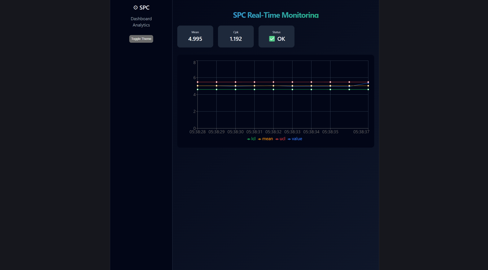
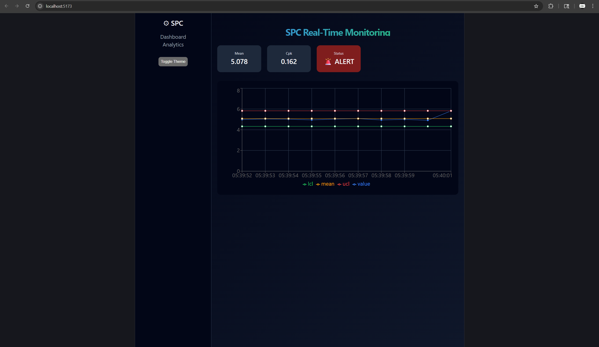
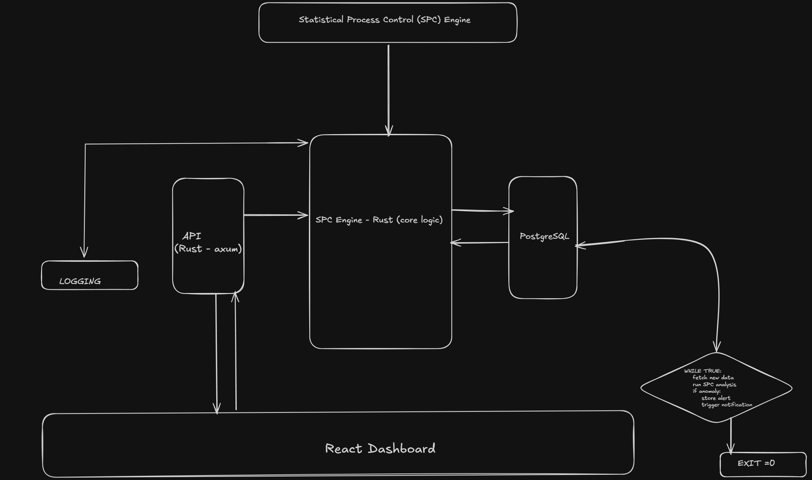

# 📊 Real-Time SPC Monitoring System


### 🚀 Live SPC Monitoring with Anomaly Detection

---

## 🖼️ Dashboard Preview

### ✅ Stable Process


### 🚨 Out-of-Control Process


---

## 🧭 System Architecture



---

## 🧠 Overview

A full-stack system for real-time **Statistical Process Control (SPC)**, designed to monitor process stability, detect anomalies, and visualize trends through an interactive dashboard.

This project simulates industrial process data and applies statistical analysis to identify deviations in real time.

---

## 🚀 Features

- 📈 Real-time time-series visualization  
- 📊 Process capability analysis (Cp, Cpk)  
- 🚨 Automatic anomaly detection  
- 🔴 Out-of-control point highlighting  
- ⏱ Time-based data tracking  
- 🌗 Dark / Light mode UI  
- ⚡ Smooth animations (Framer Motion)  
- 🧭 Dashboard layout with sidebar  

---

## 🏗️ Architecture Flow
Frontend (React Dashboard)
↓
API Layer (Rust - Axum)
↓
SPC Engine (Core Logic)
↓
Statistical Analysis (Mean, Variance, Cp, Cpk)

---

## ⚙️ Tech Stack

### Backend
- Rust  
- Axum  
- Tokio  

### Frontend
- React  
- Recharts  
- Framer Motion  

---

## 📦 Setup Instructions

### 🔧 Backend

```bash
cd spc-engine
cargo run
Runs on: http://127.0.0.1:3000

💻 Frontend
cd spc-dashboard
npm install
npm run dev

Runs on: http://localhost:5173
```

## 📊 Key Concepts

- Statistical Process Control (SPC)  
- Control Limits (UCL / LCL)  
- Process Capability (Cp, Cpk)  
- Real-time monitoring systems  
- Anomaly detection  

---

## 🔍 How It Works

1. Frontend generates simulated process data  
2. Data is sent to the Rust backend API  
3. Backend computes:
   - Mean  
   - Standard deviation  
   - Control limits (UCL / LCL)  
   - Cp / Cpk  
4. Response is returned to frontend  
5. Dashboard visualizes results in real time  
6. Out-of-control points are highlighted  

---

## 📌 Future Improvements

- 🔄 WebSocket-based real-time streaming  
- 🗄️ Persistent storage (PostgreSQL)  
- 📉 Advanced SPC rules (Western Electric rules)  
- 📊 Multi-process monitoring  
- 🔔 Alert notifications  

---

## 👤 Author

Akshay Choudhary


